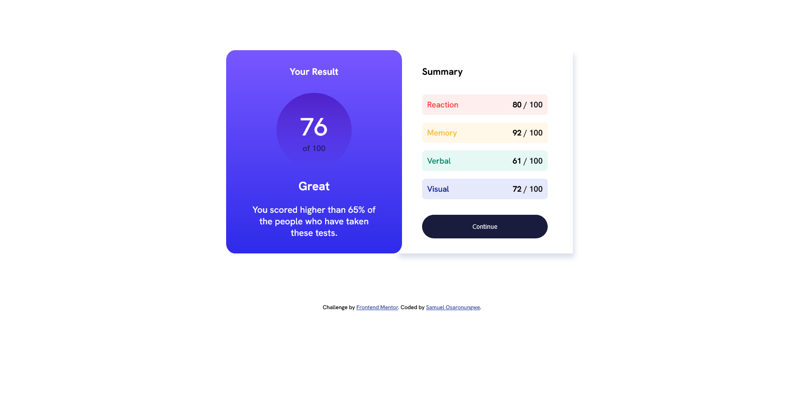

# Frontend Mentor - Results summary component solution

This is a solution to the [Results summary component challenge on Frontend Mentor](https://www.frontendmentor.io/challenges/results-summary-component-CE_K6s0maV). Frontend Mentor challenges help you improve your coding skills by building realistic projects. 

## Table of contents

- [Overview](#overview)
  - [The challenge](#the-challenge)
  - [Screenshot](#screenshot)
  - [Links](#links)
- [My process](#my-process)
  - [Built with](#built-with)
  - [What I learned](#what-i-learned)
  - [Continued development](#continued-development)
  - [Useful resources](#useful-resources)
- [Author](#author)
- [Acknowledgments](#acknowledgments)

## Overview

### The challenge

Users should be able to:

- View the optimal layout for the interface depending on their device's screen size
- See hover and focus states for all interactive elements on the page
- **Bonus**: Use the local JSON data to dynamically populate the content

### Screenshot



### Links

- Solution URL: [Add solution URL here](https://your-solution-url.com)
- Live Site URL: (https://sicktooth.github.io/results-summary-component-main/)

## My process

### Built with

- Semantic HTML5 markup
- CSS custom properties
- CSS Grid
- Desktop-first workflow
- Media queries

### What I learned

I learnt about the functionality of the grid-template-column in css and also spacing, typography and positioning.

To see how you can add code snippets, see below:

```css
.proud-of-this-css {
  background: linear-gradient(to bottom, hsl(252, 100%, 67%), hsl(241, 81%, 54%));
}
```

If you want more help with writing markdown, we'd recommend checking out [The Markdown Guide](https://www.markdownguide.org/) to learn more.

### Continued development

I want to focus on a programming language and also backend in the future.

### Useful resources

- [CSS Box shadow](https://developer.mozilla.org/en-US/docs/Web/CSS/box-shadow) - This helped me for box-shadow syntax understanding. I really liked this pattern and will use it going forward.
- [Adding linear-gradient](https://developer.mozilla.org/en-US/docs/Web/CSS/gradient/linear-gradient) - This is an amazing article which helped me finally Linear gradient in CSS. I'd recommend it to anyone still learning this concept.

## Author

- Website - [Samuel Osaronungwe](https://sicktooth.github.io/portfolio/)
- Frontend Mentor - [@sicktooth](https://https://www.frontendmentor.io/profile/sicktooth)
- Twitter - [@sammy_o_osaro](https://twitter.com/Sammy_O_Osaro)

## Acknowledgments

I would like to thank the following people for their suggestions: 
- MDN docs
- W3Schools 
with the following listed above I was able to finish this project. Thanks.
